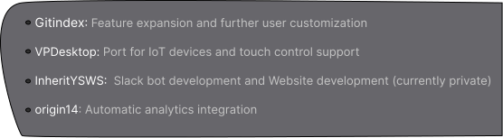
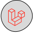

  

  
  
  

  

<!-- side sections -->

  

    
  

  

  

    

      
    

    
  

  

    <a href="#readme">
      

        
      

    </a>
  

  

    <h3>Frontend</h3>
  

  

    
  

  

    <h3>Backend</h3>
  

  

    <a href="#readme"><a href="#readme">
  

  

    <h3>Languages</h3>
  

  

    
  

